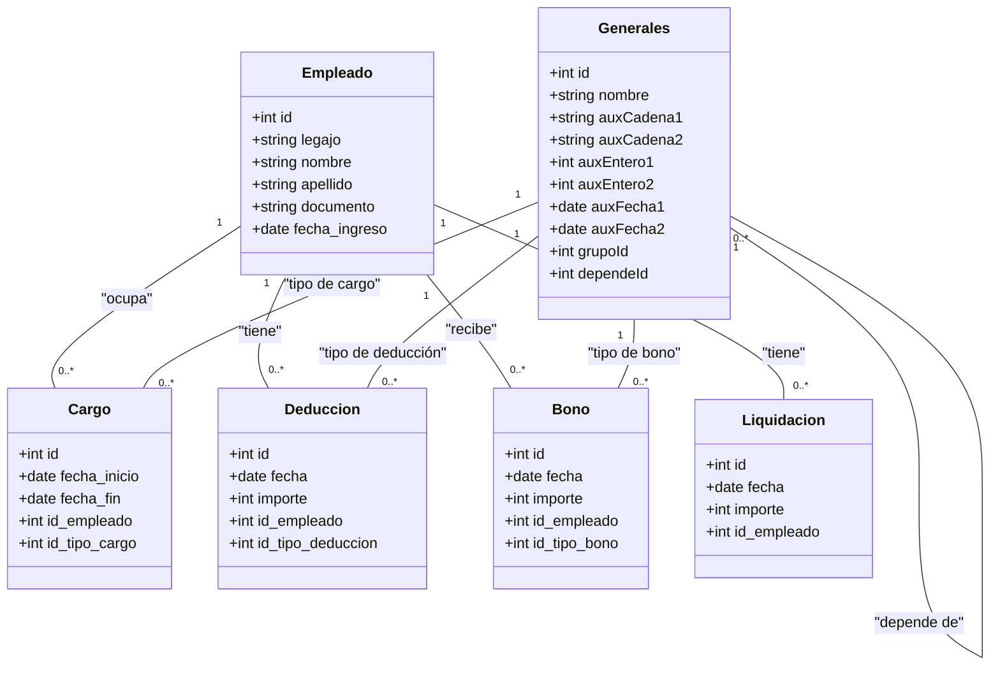

```mermaid
classDiagram
    class Empleado {
        +int id
        +string legajo
        +string nombre
        +string apellido
        +string documento
        +date fecha_ingreso
    }

    class Cargo {
        +int id
        +date fecha_inicio
        +date fecha_fin
        +int id_empleado
        +int id_tipo_cargo
    }

    class Deduccion {
        +int id
        +date fecha
        +int importe
        +int id_empleado
        +int id_tipo_deduccion
    }

    class Bono {
        +int id
        +date fecha
        +int importe
        +int id_empleado
        +int id_tipo_bono
    }

    class Liquidacion {
        +int id
        +date fecha
        +int importe
        +int id_empleado
    }

    class Generales {
        +int id
        +string nombre
        +string auxCadena1
        +string auxCadena2
        +int auxEntero1
        +int auxEntero2
        +date auxFecha1
        +date auxFecha2
        +int grupoId
        +int dependeId
    }

    %% Relationships
    Empleado "1" -- "0..*" Cargo : "ocupa"
    Empleado "1" -- "0..*" Deduccion : "tiene"
    Empleado "1" -- "0..*" Bono : "recibe"
    Empleado "1" -- "0..*" Liquidacion : "tiene"
    Generales "1" -- "0..*" Cargo : "tipo de cargo"
    Generales "1" -- "0..*" Deduccion : "tipo de deducción"
    Generales "1" -- "0..*" Bono : "tipo de bono"
    Generales "1" -- "0..*" Generales : "depende de"
```