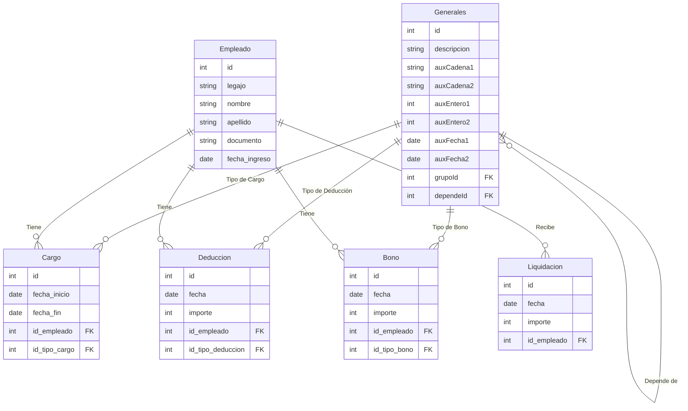

```mermaid

erDiagram
    Empleado {
        int id
        string legajo
        string nombre
        string apellido
        string documento
        date fecha_ingreso
    }
    
    Cargo {
        int id
        date fecha_inicio
        date fecha_fin
        int id_empleado FK
        int id_tipo_cargo FK 
    }
    
    Deduccion {
        int id
        date fecha
        int importe
        int id_empleado FK
        int id_tipo_deduccion FK
    }
    
    Bono {
        int id
        date fecha
        int importe
        int id_empleado FK
        int id_tipo_bono FK 
    }
    
    Liquidacion {
        int id
        date fecha
        int importe
        int id_empleado FK
    }
    
    Generales {
        int id
        string descripcion
        string auxCadena1
        string auxCadena2
        int auxEntero1
        int auxEntero2
        date auxFecha1
        date auxFecha2
        int grupoId FK
        int dependeId FK
    }
    
    Generales ||--o{ Generales : "Depende de"
    Generales ||--o{ Cargo : "Tipo de Cargo"
    Generales ||--o{ Deduccion : "Tipo de Deducción"
    Generales ||--o{ Bono : "Tipo de Bono"
    Empleado ||--o{ Cargo : "Tiene"
    Empleado ||--o{ Deduccion : "Tiene"
    Empleado ||--o{ Bono : "Tiene"
    Empleado ||--o{ Liquidacion : "Recibe"

```