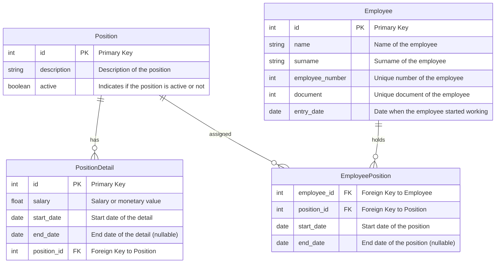

```mermaid

erDiagram
    Position {
        int id PK "Primary Key"
        string description "Description of the position"
        boolean active "Indicates if the position is active or not"
    }
    
    PositionDetail {
        int id PK "Primary Key"
        float salary "Salary or monetary value"
        date start_date "Start date of the detail"
        date end_date "End date of the detail (nullable)"
        int position_id FK "Foreign Key to Position"
    }
    
    Employee {
        int id PK "Primary Key"
        string name "Name of the employee"
        string surname "Surname of the employee"
        int employee_number "Unique number of the employee"
        int document "Unique document of the employee"
        date entry_date "Date when the employee started working"
    }
    
    EmployeePosition {
        int employee_id FK "Foreign Key to Employee"
        int position_id FK "Foreign Key to Position"
        date start_date "Start date of the position"
        date end_date "End date of the position (nullable)"
    }
    
    Position ||--o{ PositionDetail : "has"
    Employee ||--o{ EmployeePosition : "holds"
    Position ||--o{ EmployeePosition : "assigned"

```