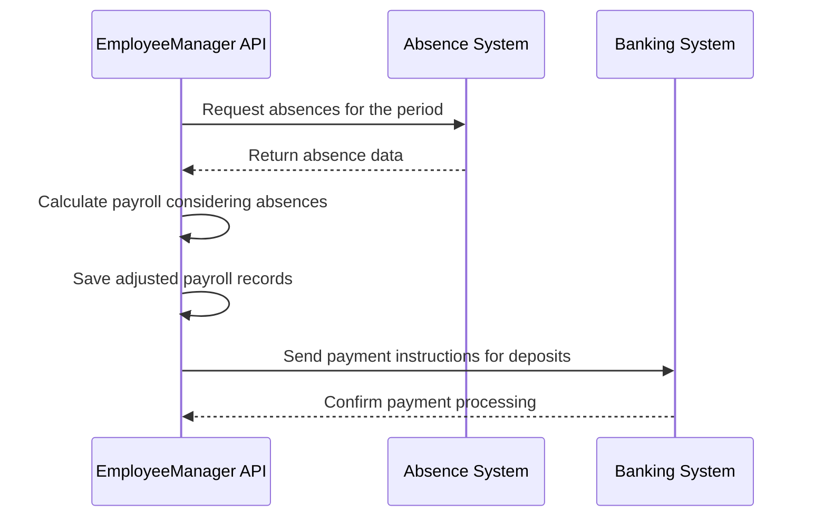

```mermaid

sequenceDiagram
    participant EmployeeManager as EmployeeManager API
    participant AbsenceSystem as Absence System
    participant BankingSystem as Banking System

    EmployeeManager->>AbsenceSystem: Request absences for the period
    AbsenceSystem-->>EmployeeManager: Return absence data
    EmployeeManager->>EmployeeManager: Calculate payroll considering absences
    EmployeeManager->>EmployeeManager: Save adjusted payroll records
    EmployeeManager->>BankingSystem: Send payment instructions for deposits
    BankingSystem-->>EmployeeManager: Confirm payment processing


```